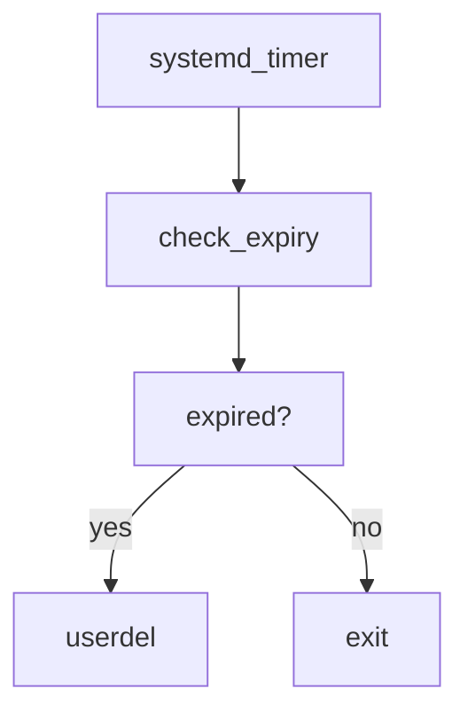

# Linux Expired User Cleanup
A Linux automation project that periodically checks user account expiry dates
and automatically removes accounts that have expired.

The project uses:
+ Bash scripting
+ ```chage``` for account expiry information
+ ```userdel``` for account removal
+ ```systemd service```
+ ```systemd timer```

The goal is to demonstrate basic Linux administration and automation using
native Linux tools.

## Project Overview
Linux allows administrators to configure an expiry date for user accounts.
For example:

Account expires : Sep 23, 2026

Once the expiry date is reached, the account can no longer be used normally.
This project automates the cleanup process:


##
### Learning Objectives

This project was created as a practical Linux exercise to understand
how Linux automation works without relying on third-party automation platforms.

It demonstrates the workflow:

`Linux command`

&darr;

`Bash script`

&darr;

`systemd service`

&darr;

`systemd timer`

&darr;

`Automated task`

## 

### Installation
1. Copy the script

   Place the script in:
   ```bash
   sudo cp test.sh /usr/local/bin/
   ```
   Make it executable:
   ```bash
   sudo chmod +x /usr/local/bin/test.sh
   ```
##

2. Install the systemd service and timer
   
   Copy:
   ```bash
   sudo cp delete-expired-users.service \
   delete-expired-users.timer /etc/systemd/system
   ```
##

3. Reload systemd

   ```bash
   sudo systemctl daemon-reload
   ```
##

4. Test the service and timer manually

   Before enabling automatic execution, run:
   ```bash
   sudo systemctl start delete-expired-users.service
   ```

   Check the result:
   ```bash
   sudo systemctl status delete-expired-users.service
   ```
   Then:
   ```bash
   sudo systemctl enable --now delete-expired-users.timer
   ```
##

### Checking Logs

systemd stores service output in the journal.

View the latest logs:

```bash
sudo journalctl -u delete-expired-users.service
```
##
   
